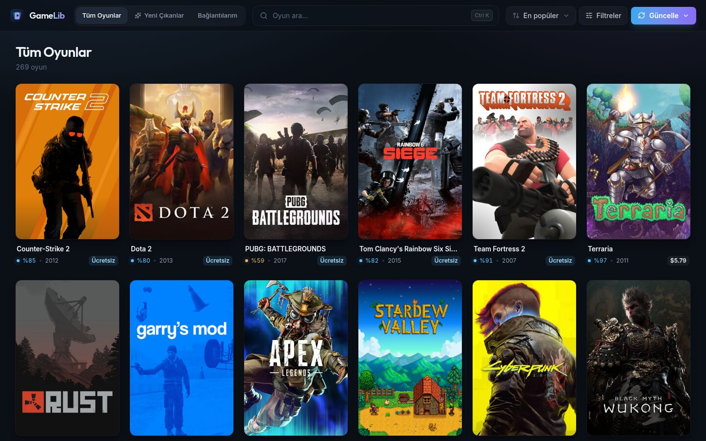
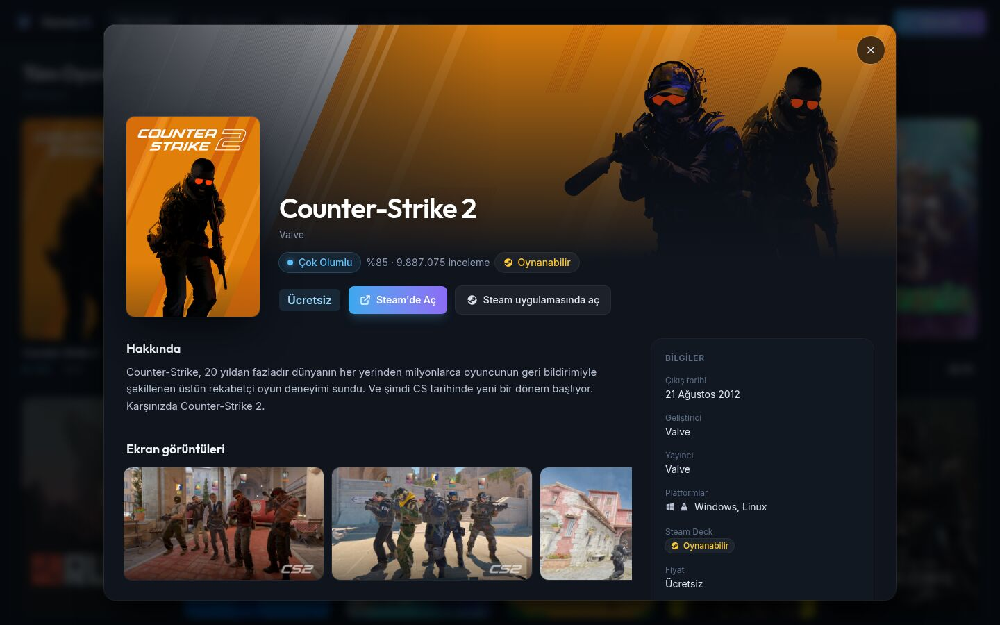
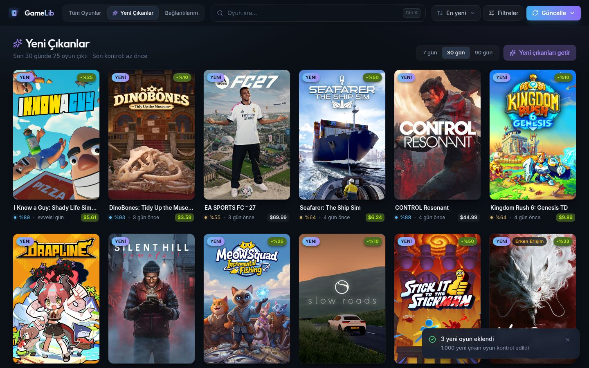
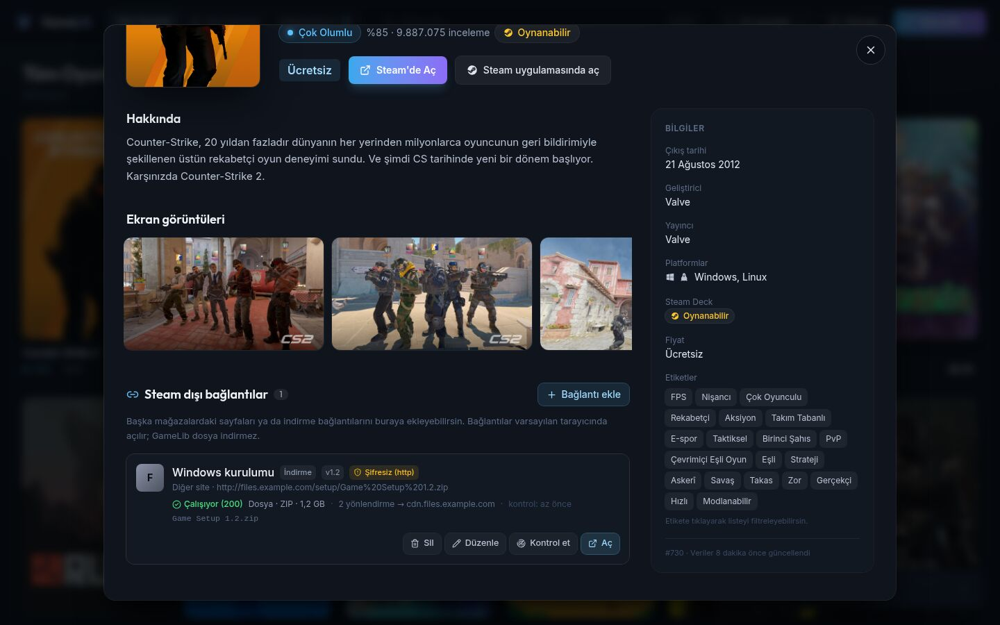

# GameLib

Steam'deki **tüm çıkmış oyunları** kapak görselleriyle birlikte bilgisayarına indiren ve şık, hızlı bir arayüzde listeleyen masaüstü uygulaması. Oyunların GOG ve itch.io'daki karşılıklarını otomatik bulur; bu mağazalarda sahip olduğun oyunları uygulamanın içinden indirip kurar ve kendini GitHub'daki yeni sürümlerle günceller. Windows, macOS ve Linux'ta çalışır ([Tauri v2](https://tauri.app) + React).



| Detay penceresi | Yeni çıkanlar |
| --- | --- |
|  |  |

## Kurulum (hazır paket)

Rust ya da Node kurmana gerek yok: kurulum dosyaları GitHub Actions'ta derlenir.

Yayımlanmış bir sürüm varsa en kolayı GitHub'daki **Releases** sayfasından sistemine uygun dosyayı indirmektir (Windows: `GameLib_<sürüm>_x64-setup.exe`). İmzalı bir sürümle kurulan GameLib sonraki sürümleri kendisi bulup kurar (bkz. [Otomatik güncelleme](#otomatik-güncelleme)). Yayın yoksa ya da henüz yayımlanmamış bir değişikliği denemek istiyorsan:

1. GitHub'da depoyu aç: **Actions → Build → Run workflow**. Sistem olarak `windows`'u (ya da `all`, `macos`, `linux`) seç ve başlat.
2. Derleme yaklaşık 15–20 dakika sürer. Bitince çalıştırmayı aç ve sayfanın altındaki **Artifacts** bölümünden paketi indirip zip dosyasını aç. Örneğin `gamelib-windows` şunları içerir:
   - `GameLib_0.1.0_x64-setup.exe`: masaüstü uygulamasının kurulumu.
   - `gamelib-cli-windows-x64.exe`: komut satırı aracı (tarayıcı önizlemesi için, aşağıya bak).
3. Kurulumu çalıştır. Paket imzasız olduğu için Windows "Windows bilgisayarınızı korudu" uyarısı gösterebilir: **Ek bilgi → Yine de çalıştır**.

Diğer sistemler:

- **macOS** (`gamelib-macos`): `.dmg` dosyasını açıp GameLib'i Uygulamalar klasörüne sürükle. İlk açılışta uyarı çıkarsa **Sistem Ayarları → Gizlilik ve Güvenlik → Yine de Aç**.
- **Linux** (`gamelib-linux`): `.deb` ya da `.rpm` paketini kur, ya da `.AppImage` dosyasını `chmod +x` ile çalıştırılabilir yapıp aç.

Artifacts 7 gün saklanır. Windows paketi, son commit mesajında `[installer]` geçen her push'ta da üretilir. `v` ile başlayan bir sürüm etiketi (ör. `v0.1.0`) gönderildiğinde tüm sistemlerin dosyaları kalıcı olarak bir GitHub Release'e de eklenir.

## Özellikler

- **Tüm katalog:** Steam'deki ~130.600 çıkmış oyun, dikey kapak görselleriyle. Katalog yerel veritabanında durduğu için arama ve filtreler anında çalışır.
- **Arama ve filtreler:**
  - Türkçe karakter ve noktalama duyarsız arama. Örneğin "baldurs" yazınca *Baldur's Gate 3*, "stalker" yazınca *S.T.A.L.K.E.R.* bulunur.
  - Türkçe etiketler, platform, Steam Deck uyumu, inceleme puanı ve "yalnızca ücretsiz" filtreleri.
  - Altı sıralama seçeneği.
- **Yeni çıkanlar (istendiğinde):** "Yeni çıkanları getir", yalnızca son kontrolden bu yana çıkan oyunları çeker; bu genellikle tek istek ve birkaç saniye sürer. Ayrı sekmede son 7, 30 ya da 90 günün oyunları listelenir.
- **Detay penceresi:**
  - Büyük görsel, varsa Türkçe açıklama ve büyütülebilir ekran görüntüleri.
  - Fiyat ve indirim, geliştirici, yayıncı, platformlar, Steam Deck durumu.
  - Etiketler; tıklanınca filtreye eklenir.
  - "Steam'de Aç" ve "Steam uygulamasında aç" düğmeleri.
- **Mağazalar (GOG ve itch.io):**
  - "Güncelle → Mağazaları eşleştir" GOG kataloğunu indirir ve Steam oyunlarıyla eşleştirir: önce ada, geliştiriciye ve çıkış yılına göre, sonra GOG'un kendi kimlik eşlemesiyle (GamesDB). Kenar çubuğundaki "GOG" görünümü GOG'da da satılan oyunları listeler.
  - Oyun detayındaki "Mağazalar" bölümü karşılıkları gösterir; ada göre yapılan eşleşmeler onaylanabilir ya da reddedilebilir. itch.io'da Steam kimliği olmadığı için oyun aranıp elle bağlanır.
- **Hesaplar ve kütüphane:** GOG hesabınla giriş yapar, itch.io için bir API anahtarı eklersin. "Sahip olduklarım" iki hesaptaki oyunları, "Kurulu" kurulu olanları listeler.
- **İndirme ve kurulum:**
  - GOG'da sahip olduğun ve itch.io'da sahip olduğun ya da ücretsiz olan oyunlar "İndir" ile indirilir. Bilgisayarına uygun dosya (ör. Windows, Türkçe) önceden seçili gelir.
  - İndirmeler sıraya girer, duraklatılıp sürdürülebilir, uygulama kapansa bile kaldığı yerden devam eder. GOG dosyaları MD5 ile doğrulanır.
  - İndirme bitince kurulum kendiliğinden başlar; ardından "Oyna", oyun klasörü ve "Kaldır" kullanılabilir. Ayrıntılar: [İndirme ve kurulum](#indirme-ve-kurulum).
- **Otomatik güncelleme:** Uygulama yeni sürümleri GitHub'dan bulur, imzasını doğrular ve onayınla kurar.
- **Steam dışı bağlantılar:**
  - Her oyuna elle bağlantı eklenebilir, düzenlenebilir ve silinebilir.
  - "Kontrol et" bağlantının yönlendirmelerini izler ve son adresi, dosya adını, türünü ve boyutunu gösterir; dosyayı indirmez.
  - Bu bağlantılar varsayılan tarayıcıda açılır; uygulamanın içinden indirme yalnızca GOG ve itch.io için yapılır.
  - Her site için ayrı bir işleyici yazılabilir (bkz. [Yeni site işleyicisi ekleme](#yeni-site-işleyicisi-ekleme)).
- **Yetişkin içerik** Steam'de olduğu gibi varsayılan olarak gizlidir; filtrelerden açılabilir.



## Nasıl çalışır

- **Veri kaynağı:** Valve eski `ISteamApps/GetAppList` servisini kaldırdı, yenisi ise API anahtarı istiyor. GameLib bunun yerine Steam mağazasının kendi kullandığı anahtarsız servisleri kullanır:
  - `IStoreQueryService/Query`: oyun listesi, sayfa başına 1000 oyun.
  - `IStoreService/GetTagList`: Türkçe etiket adları.
  - `IStoreBrowseService/GetItems`: detay penceresindeki Türkçe açıklama ve ekran görüntüleri.
- **Bölge ve dil:**
  - Bölge Türkiye'dir, fiyatlar Steam'in Türkiye için belirlediği USD fiyatlarıdır.
  - Açıklamalar İngilizce çekilir, çünkü çoğu oyunun Türkçe açıklaması yoktur. Türkçesi olanlar detay penceresinde Türkçe gösterilir.
- **Depolama:** Katalog yerel bir SQLite veritabanında (WAL, FTS5 arama) tutulur ve yaklaşık 130 MB yer kaplar. Görseller indirilmez, Steam'in sunucularından gösterilir.
- **Tam güncelleme:**
  - ~130 istekte yapılır ve 4–8 dakika sürer.
  - Önce en çok satanlar gelir, böylece ızgara birkaç saniyede dolar.
  - Yarıda kalırsa kaldığı yerden devam eder.
- **Güvenli güncelleme:** Mağazadan kalkan oyunlar silinmez, yalnızca gizlenir. Eklediğin bağlantılar ve eşleşmeler için verdiğin kararlar hiçbir güncellemeden etkilenmez.
- **GOG eşleştirme:** GOG kataloğu giriş gerektirmeyen `catalog.gog.com` servisinden ~80 istekte alınır. GOG'un GamesDB servisi GOG ürünlerinin Steam kimliklerini verir; ilk eşleştirmede bu kontrol birkaç dakika sürer, sonrakilerde yalnızca yeni ürünler sorulur. GamesDB'ye ulaşılamazsa ada göre eşleşmeler kullanılır.

## Mağazalar ve hesaplar

Hesaplar **Ayarlar** sayfasından bağlanır:

- **GOG:** "GOG ile giriş yap" ayrı bir pencerede GOG'un kendi giriş sayfasını açar; şifren GameLib'e gelmez. Pencere açılmazsa "Kodla giriş" ile giriş sayfasını tarayıcıda açıp girişten sonra açılan adresi yapıştırabilirsin.
  GameLib, Heroic ve Lutris gibi GOG Galaxy'nin giriş istemcisini kullanır. Bu GOG'un resmî olarak sunduğu bir yöntem değildir; GOG'un kullanıcı sözleşmesi yetkisiz üçüncü taraf programları yasaklar. Bu yolla giriş yapmanın riski hesap sahibine aittir.
- **itch.io:** itch.io'da **Settings → API keys** sayfasından bir anahtar oluştur ("API anahtarı oluştur" düğmesi bu sayfayı açar) ve yapıştır.
- **Güvenlik:** Giriş bilgileri veritabanının yanındaki `secrets.bin` dosyasında tutulur. Windows'ta kullanıcı hesabına özel olarak şifrelenir (DPAPI), macOS ve Linux'ta yalnızca senin okuyabileceğin izinlerle yazılır. Veritabanına, arayüze ve günlüklere girmez.

Giriş yaptıktan sonra hesaplardaki oyunlar okunur ve Steam oyunlarıyla eşleştirilir. Kütüphaneyi "Sahip olduklarım → Kütüphaneyi yenile" ile ya da "Mağazaları eşleştir" ile güncelleyebilirsin.

## İndirme ve kurulum

- **Kütüphane klasörü:** Oyunlar Ayarlar'da seçilen klasöre (varsayılan `%USERPROFILE%\Games`) kurulur. İndirmeler kurulana kadar bu klasördeki `.gamelib\downloads` altında durur; "Kurulum dosyalarını sakla" kapalıysa başarılı kurulumdan sonra silinir.
- **GOG (Windows):** GOG'un kurulum programı sessiz modda, doğrudan kütüphane klasörüne kurar. GOG kurulumları yönetici izni istediği için her kurulumda bir kez Windows'un izin penceresi (UAC) çıkar. "Oyna" oyunun `goggame-<id>.info` dosyasındaki ana görevi başlatır.
- **itch.io:** zip, 7z ve tar arşivleri GameLib tarafından açılır. Başlatılacak dosya oyunun `.itch.toml` dosyasından, yoksa klasördeki programlar arasından seçilir; oyun menüsündeki "Başlatılacak dosya" ile değiştirilebilir. Güncellemeler aynı klasöre açılır, klasördeki kayıt dosyaları korunur.
- **Geliştiricinin kendi kurulum programı** (itch.io'da bazı oyunlar): yalnızca sen "Kurulumu başlat" dediğinde çalışır.
- **Kurulamayanlar:** RAR arşivleri, macOS paketleri, Linux kurulum betikleri ve başka bir sistem için olan dosyalar indirilenler klasöründe kalır; "Klasörü aç" ile elle kurabilirsin.
- **Güvenlik:** Windows'ta indirilen dosyalar tarayıcıların yaptığı gibi "internetten indirildi" olarak işaretlenir ve çalıştırılmadan önce antivirüse taratılır. Arşivler oyun klasörünün dışına dosya yazamaz.
- **GOG Galaxy ile kurulanlar:** Windows'ta GOG Galaxy'nin (ya da elle çalıştırılan GOG kurulumlarının) kurduğu oyunlar da "Kurulu" listesinde görünür ve GameLib'den başlatılabilir.
- **Kaldırma:** GOG oyunlarında oyunun kendi kaldırma programı sessizce çalışır; GameLib'in açtığı arşivlerde oyun klasörü silinir. Kütüphane klasörünün dışındaki hiçbir şey silinmez.
- **macOS ve Linux:** İndirme ve arşiv açma çalışır; GOG'un `.pkg` ve `.sh` kurulumlarını otomatik çalıştırma şimdilik yalnızca Windows'ta.

## Gereksinimler

Yalnızca kaynak koddan derlemek ya da geliştirmek için gerekir; hazır paketler için bkz. [Kurulum](#kurulum-hazır-paket).

- Node.js 22.12+ ve pnpm 10
- Rust 1.90+
- İşletim sistemine göre:
  - **Linux (Debian/Ubuntu):**
    `sudo apt install libwebkit2gtk-4.1-dev libgtk-3-dev librsvg2-dev libayatana-appindicator3-dev libxdo-dev build-essential pkg-config`.
    WebKitGTK 2.40 veya üstü gerekir.
  - **Windows:** Microsoft C++ Build Tools ve WebView2. WebView2 Windows 10/11'de hazır gelir.
  - **macOS:** Xcode Command Line Tools ve macOS 13.3 veya üstü.

## Geliştirme

```bash
pnpm install
pnpm tauri dev          # uygulamayı geliştirme modunda açar
```

**Tarayıcı önizlemesi:** `pnpm dev` komutundan sonra http://localhost:1420 adresini aç. Önizleme Tauri olmadan çalışır; verinin nereden geldiğini sol alttaki rozet gösterir:

- **Yerel katalog:** Başka bir terminalde `gamelib-cli serve` çalışıyorsa (kaynak koddan: `pnpm serve`) önizleme masaüstü uygulamasının veritabanındaki gerçek kataloğu gösterir. Arama, detay, bağlantılar ve güncellemeler bu sunucu üzerinden çalışır. Katalog henüz boşsa "Kataloğu indir" ile tarayıcıdan da indirebilirsin.
- **Örnek veri:** Sunucu çalışmıyorsa gerçek katalogdan alınmış 272 oyunluk örnek veri kullanılır. Sunucuyu başlatıp sayfayı yenilemen yeterli.
- `?mock` her zaman örnek veriyi, `?mock=empty` ilk açılış ekranını açar.
- Örnek veriyi yenilemek için önce bir katalog indir, sonra `pnpm fixture` çalıştır.

Windows'ta Rust kurmadan gerçek kataloğu tarayıcıda görmek için hazır paketteki `gamelib-cli-windows-x64.exe` dosyasını kullan:

```powershell
.\gamelib-cli-windows-x64.exe serve   # 1. terminal: yerel sunucu
pnpm dev                              # 2. terminal: önizleme, ardından http://localhost:1420
```

Sunucu yalnızca `127.0.0.1` adresini dinler ve yalnızca bu bilgisayardaki sayfalardan gelen istekleri kabul eder. Durdurmak için Ctrl+C.

Testler ve kontroller:

```bash
cargo test                                  # çekirdek ve CLI (GTK gerektirmez)
cargo test -p gamelib-core -- --ignored     # gerçek Steam API'siyle canlı test
pnpm test                                   # arayüz yardımcıları
cargo clippy --workspace --all-targets -- -D warnings
cargo fmt --all
```

## Derleme

```bash
pnpm tauri build        # işletim sistemine uygun kurulum paketlerini üretir
```

Aynı derleme `.github/workflows/build.yml` ile GitHub Actions'ta da yapılır (bkz. [Kurulum](#kurulum-hazır-paket)). Her push'ta biçim, lint ve testler Linux'ta, Windows'a özel kod (şifreleme, kurulum, kayıt defteri) Windows'ta derlenip test edilir; kurulum paketleri yalnızca elle başlatılan çalıştırmalarda, `[installer]` içeren commit'lerde ve sürüm yayımlarken üretilir.

## Otomatik güncelleme

Uygulama açıldıktan kısa süre sonra ve birkaç saatte bir bu deponun son yayınındaki `latest.json` dosyasına bakar. Yeni sürüm varsa üstte "GameLib X hazır · Şimdi güncelle" çıkar. Güncelleme indirilir, yayının imzası uygulamaya gömülü açık anahtarla doğrulanır ve kurulup uygulama yeniden açılır (Windows'ta yönetici izni gerekmez). Otomatik denetimi Ayarlar → Güncellemeler'den kapatabilir, "Güncellemeleri denetle" ile elle bakabilirsin. Bir oyun kurulurken güncelleme başlamaz; süren indirmeler yeni sürüm açılınca kaldığı yerden devam eder.

Bunun çalışması için depo herkese açık olmalı ve sürümler imzalanmalıdır. İmzasız bir derlemeyle kurulan GameLib kendini güncelleyemez; Ayarlar'da bunu söyler. İmzalı ilk sürüm bir kez elle kurulur, sonrakiler kendiliğinden gelir.

### İmza anahtarı (bir kez)

1. Depoyu herkese açık yap: **Settings → General → Danger Zone → Change repository visibility → Public**.
2. Kendi bilgisayarında, depo klasöründe (PowerShell):
   ```powershell
   pnpm tauri signer generate -w "$env:USERPROFILE\.tauri\gamelib.key"
   ```
   Komut bir parola sorar ve iki dosya üretir: `gamelib.key` (gizli anahtar) ve `gamelib.key.pub` (açık anahtar).
3. **Settings → Secrets and variables → Actions** sayfasında:
   - **Secrets** sekmesi: `TAURI_SIGNING_PRIVATE_KEY` = `gamelib.key` dosyasının içeriği, `TAURI_SIGNING_PRIVATE_KEY_PASSWORD` = parola.
   - **Variables** sekmesi: `TAURI_UPDATER_PUBKEY` = `gamelib.key.pub` dosyasının içeriği. (Alternatif olarak bu değer `src-tauri/tauri.conf.json` içindeki `plugins.updater.pubkey` alanına yazılabilir; açık anahtardır, paylaşmak güvenlidir.)
4. Gizli anahtarı ve parolayı güvenli bir yere yedekle. Kaybolursa kurulu uygulamalar yeni sürümleri bir daha doğrulayamaz; herkesin yeni anahtarla imzalanmış bir sürümü elle kurması gerekir.

### Sürüm yayımlama

**Actions → Build → Run workflow**, dal olarak ana dalı seç, **release_version** alanına yeni sürümü yaz (ör. `0.2.0`) ve başlat. İş akışı:

1. Sürüm numarasını her yerde günceller (`Cargo.toml`, `Cargo.lock`, `package.json`), "Sürüm 0.2.0" commit'ini ve `v0.2.0` etiketini push'lar.
2. Windows, macOS ve Linux paketlerini etiketten derler; imza anahtarı varsa güncelleme dosyalarını imzalar.
3. Hepsi başarılıysa GitHub yayınını önce taslak olarak oluşturur, dosyaları ve `latest.json`'u yükler, sonra yayımlar ve "Latest" yapar.

Sürümü elle değiştirmek için `node scripts/set-version.mjs 0.2.0`; ardından bir `v0.2.0` etiketi push'lamak da aynı derleme ve yayını başlatır.

## Komut satırı aracı

`gamelib-cli`, katalogla arayüz olmadan çalışmayı sağlar. Hazır paketteki dosyayı doğrudan, kaynak koddan ise `cargo run --release -p gamelib-cli --` ile çalıştırabilirsin:

```bash
gamelib-cli serve                                    # tarayıcı önizlemesine gerçek kataloğu sunar
gamelib-cli sync                                     # tüm kataloğu indirir
gamelib-cli new-releases                             # yeni çıkanları getirir
gamelib-cli query --search "witcher" --limit 5
gamelib-cli stats
gamelib-cli check-link https://ornek.com/dosya.zip   # yönlendirmeleri izler, indirmez
gamelib-cli stores sync                              # GOG kataloğunu indirir ve eşleştirir
gamelib-cli stores stats                             # eşleşme sayıları
gamelib-cli stores match 292030                      # bir Steam oyununun mağaza karşılıkları
```

Tarayıcı önizlemesi mağaza eşleştirmesini ve hesapları da gösterir; indirme, kurulum ve güncelleme yalnızca masaüstü uygulamasında yapılır.

Varsayılan olarak masaüstü uygulamasının veritabanını kullanır (bkz. [Veri konumu](#veri-konumu)), böylece ikisi aynı kataloğu görür. Başka bir dosya için `--db PATH` ver. Masaüstü uygulaması ve CLI aynı anda katalog indirmeye çalışırsa ikincisi "zaten bir güncelleme sürüyor" yanıtı alır. Tüm komutlar için `help` alt komutuna bak.

## Veri konumu

| Sistem | Veritabanı |
| --- | --- |
| Windows | `%LOCALAPPDATA%\com.gamelib.desktop\gamelib.db` |
| macOS | `~/Library/Application Support/com.gamelib.desktop/gamelib.db` |
| Linux | `~/.local/share/com.gamelib.desktop/gamelib.db` |

`gamelib-cli` de varsayılan olarak bu dosyayı kullanır. Kataloğu sıfırlamak için uygulama kapalıyken bu dosyayı silmen yeterli. Dosya silinince eklediğin bağlantılar, eşleşme kararların, indirme listesi ve kurulum kayıtları da silinir (kurulu oyunların dosyaları kalır).

Hesap bilgileri aynı klasördeki `secrets.bin` dosyasındadır; silinirse hesaplardan çıkış yapılmış olur. İndirmeler ve kurulan oyunlar kütüphane klasöründedir (bkz. [İndirme ve kurulum](#indirme-ve-kurulum)).

## Proje yapısı

```
crates/gamelib-core/   Tauri'den bağımsız çekirdek: Steam istemcisi, SQLite, senkron, bağlantılar
  src/app.rs           arayüz komutları ve arka plan işleri (masaüstü ve CLI sunucusu ortak kullanır)
  src/steam/           Steam servisleri ve görsel adresleri
  src/db/              şema, okuma/yazma, bağlantı, mağaza, indirme ve kurulum kayıtları
  src/sync.rs          tam katalog indirme
  src/new_releases.rs  yeni çıkanları getirme
  src/links/           URL doğrulama, site işleyicileri, yönlendirme kontrolü
  src/stores/          GOG kataloğu, GamesDB, eşleştirme, GOG ve itch.io hesapları
  src/secrets.rs       giriş bilgilerinin şifreli saklanması
  src/downloads/       indirme kuyruğu: sürdürme, adres yenileme, MD5 doğrulama
  src/install/         kurulum: dosya türü, arşivler, başlatılacak dosya, Windows'a özel kısımlar
crates/gamelib-cli/    komut satırı aracı ve tarayıcı önizlemesi için yerel sunucu (src/serve.rs)
src-tauri/             masaüstü kabuğu: komutlar, olaylar, pencere ve güvenlik ayarları
src/                   React arayüzü (tüm metinler src/i18n/tr.ts içinde)
  mocks/               yalnızca tarayıcı önizlemesi için: yerel sunucu köprüsü ve örnek veri
.github/workflows/     kontroller, kurulum paketleri ve sürüm yayımlama
scripts/               sürüm numarası, güncelleme imzası ayarı ve latest.json üretimi
```

## Yeni site işleyicisi ekleme

Her indirme sitesinin bağlantı yapısı ve yönlendirmeleri farklıdır. Bu yüzden siteye özel davranış, `crates/gamelib-core/src/links/sites/` altındaki işleyicilerde yazılır. Tanınmayan siteler genel işleyiciyle çalışır. Genel işleyici yalnızca standart HTTP yönlendirmelerini izler; JavaScript, captcha ya da bekleme sayfası gerektiren akışlar otomatikleştirilmez.

1. `sites/<site>.rs` dosyasında `SiteHandler` uygulayan bir tür oluştur:
   - `info()` sabit bir `id` (bağlantılarla birlikte saklanır, değiştirme), görünen ad, alan adları ve rozet rengi döndürür.
   - `normalize()` yapıştırılan adresi düzenler; isteğe bağlıdır.
   - `resolve()` sitenin özel yönlendirme adımlarını uygular; isteğe bağlıdır.
2. `sites/mod.rs` içindeki `builtin()` listesine ekle.
3. Sitenin gerçek adres örnekleriyle bir test yaz.

Örnek iskelet `sites/mod.rs` dosyasının başındaki açıklamada yer alıyor.

## Sorun giderme

- **Linux'ta boş ya da siyah pencere (bazı NVIDIA/Wayland kurulumları):** `WEBKIT_DISABLE_DMABUF_RENDERER=1 gamelib` ile başlat.
- **Kurumsal proxy:** `HTTPS_PROXY` ortam değişkeni ve sistem sertifika deposu kullanılır.
- **Steam yanıt vermiyorsa:** İstekler otomatik olarak birkaç kez yeniden denenir. Yarıda kalan indirme bir sonraki "Güncelle"de devam eder.
- **"Windows bilgisayarınızı korudu" (SmartScreen):** GameLib'in kurulum paketi ve bazı itch.io oyunları imzasızdır. **Ek bilgi → Yine de çalıştır** ile devam edebilirsin.
- **GOG kurulumu başlamıyor:** Windows'un izin penceresinde (UAC) "Evet" demelisin; "Hayır" kurulumu iptal eder. İndirmeler sayfasındaki "Yeniden dene" ile tekrar başlatabilirsin.
- **"Windows ya da antivirüs programı bu dosyayı engelledi":** Antivirüs indirilen dosyayı karantinaya aldı. Dosyaya güveniyorsan antivirüsün karantinasından geri yükleyip yeniden dene.
- **"GOG oturumunun süresi doldu":** Ayarlar'dan GOG'a yeniden giriş yap.

## Kapsam

GameLib'in içinden indirme yalnızca lisanslı kaynaklardan yapılır: GOG'da satın aldığın oyunlar ve itch.io'da satın aldığın ya da geliştiricinin ücretsiz sunduğu oyunlar. Lisanssız kopya dağıtan siteler taranmaz, eşleştirilmez ve bunlardan indirme yapılmaz; torrent ve dosya barındırma sitelerinden indirme desteklenmez. Elle eklenen bağlantılar yalnızca tarayıcıda açılır.

## Yol haritası

- GOG DLC'leri ve ek dosyaları (kılavuz, müzik) indirme
- macOS ve Linux'ta GOG kurulumlarını otomatik çalıştırma
- Windows kod imzası (ör. SignPath Foundation'ın açık kaynak projelere ücretsiz imzası), böylece SmartScreen uyarısı kalkar
- Steam demolarını ve Playtest'leri listeleme
- Bağlantıları dışa ve içe aktarma (yedekleme)
- Bilgisayardaki Steam kütüphanesini okuma
- Valve anahtarsız servisi kapatırsa API anahtarıyla çalışan yedek kaynak

## Yasal uyarı

GameLib, Valve Corporation, CD PROJEKT (GOG) ve itch.io ile bağlantılı değildir. Steam ve ilgili logolar Valve Corporation'ın, GOG ve GOG.com CD PROJEKT'in, itch.io Leaf Corp.'un ticari markalarıdır. Oyun adları, açıklamaları ve görselleri sahiplerine aittir; Steam'in herkese açık mağaza servislerinden gösterilir.
